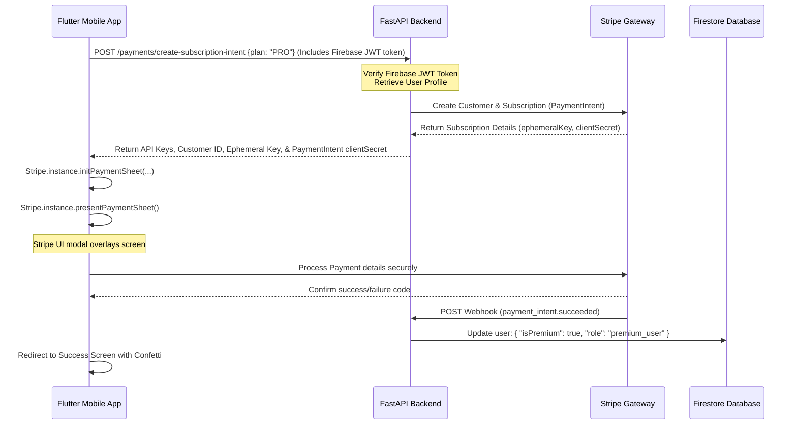

# SkillBridge AI — Production-Ready Flutter Frontend Design Specification

This document provides a highly detailed, professional, and visually premium design blueprint for the **SkillBridge AI** Flutter application. It serves as a direct implementation guide for developers or AI code-generation agents (such as Claude) to build the complete frontend, including the design system, animations, folder structure, interactive widgets, notifications, and state management integration.

> See the root [`README.md`](../README.md) for the 16-phase project roadmap,
> the Firebase Spark plan constraints, and the standing Premium UI/UX
> Redesign Directive that every screen (current and future) is built
> against — this document covers the concrete design tokens and structure
> that directive is implemented with.

---

## 1. Directory Structure (Feature-First Architecture)

To ensure scalability, clean code, and maintainability, the project is structured using a **Feature-First** approach. Each feature is split into layers: `presentation` (UI, widgets, controllers/viewmodels), `domain` (models, business logic), and `data` (repositories, API clients, data sources).

```text
lib/
├── main.dart                      # App entry point, initializes Firebase, Stripe, Riverpod
├── app/
│   ├── config/
│   │   ├── env.dart               # Environment variables config (Gemini, Stripe, API URLs)
│   │   ├── routes.dart            # GoRouter configuration & route paths
│   │   └── theme.dart             # Light/Dark modern SaaS themes & custom colors
│   ├── constants/
│   │   ├── assets.dart            # SVG, Image, Lottie, & Font asset paths
│   │   └── strings.dart           # App copy, localization constants
│   └── utils/
│       ├── formatters.dart        # Date, currency, and skill score formatters
│       └── validators.dart        # Email, password, and profile validation helpers
├── core/
│   ├── network/
│   │   ├── api_client.dart        # Dio client with interceptors for Firebase JWT injection
│   │   └── error_handler.dart     # Global API error handlers & retry mechanism
│   ├── services/
│   │   ├── auth_service.dart      # Firebase Authentication service wrapper
│   │   ├── notification_service.dart # FCM and local notification coordination
│   │   └── payment_service.dart   # Stripe PaymentSheet wrapper & status tracking
│   └── shared_widgets/
│       ├── animated_toast.dart    # Custom animated Toast widget and overlay manager
│       ├── custom_button.dart     # Responsive gradient & outline button variants
│       ├── empty_state.dart       # Illustrated custom empty states
│       ├── shimmer_loader.dart    # Shimmer/skeleton loader for async screens
│       └── global_loading.dart    # Full-screen blur overlay loader
└── features/
    ├── auth/                      # Register, Login, Forgot Password, Onboarding, Splash
    │   ├── data/
    │   ├── domain/
    │   └── presentation/
    │       ├── controllers/
    │       ├── screens/
    │       └── widgets/
    ├── profile/                   # Profile Setup, Settings, Notifications Settings
    │   ├── data/
    │   ├── domain/
    │   └── presentation/
    ├── dashboard/                 # Home Dashboard, Progress Analytics, Admin Dashboard
    │   ├── data/
    │   ├── domain/
    │   └── presentation/
    ├── resume/                    # Resume Upload, AI Resume Analysis Result
    │   ├── data/
    │   ├── domain/
    │   └── presentation/
    ├── skills/                    # Skill Assessment, Skill Gap Report
    │   ├── data/
    │   ├── domain/
    │   └── presentation/
    ├── roadmap/                   # Career Roadmap, Learning Resources
    │   ├── data/
    │   ├── domain/
    │   └── presentation/
    ├── jobs/                      # Job Matching, Job Detail
    │   ├── data/
    │   ├── domain/
    │   └── presentation/
    ├── ai_features/               # AI Chatbot Mentor, AI Mock Interview
    │   ├── data/
    │   ├── domain/
    │   └── presentation/
    └── subscription/              # Premium Subscription, Payment Status
        ├── data/
        ├── domain/
        └── presentation/
```

---

## 2. Design System & Visual Identity

The design language of **SkillBridge AI** is **Modern SaaS Premium** with glassmorphism touches, vibrant gradients, high-contrast typography, and smooth micro-animations.

### A. Color Palette (Light & Dark Theme)

We avoid generic primary colors and use high-end, tailored HSL values:

| Theme Token | Light Mode Value | Dark Mode Value | Usage |
| :--- | :--- | :--- | :--- |
| **Primary (Royal Blue)** | `#2563EB` (HSL `221, 83%, 53%`) | `#3B82F6` (HSL `217, 91%, 60%`) | Primary brand CTA, highlights, active nav |
| **Secondary (Vibrant Violet)** | `#7C3AED` (HSL `263, 83%, 58%`) | `#8B5CF6` (HSL `258, 90%, 66%`) | Accents, premium chips, gradients |
| **Success (Emerald)** | `#059669` (HSL `162, 93%, 30%`) | `#10B981` (HSL `160, 84%, 43%`) | ATS high scores, matched skills, paid status |
| **Warning (Amber)** | `#D97706` (HSL `32, 95%, 44%`) | `#F59E0B` (HSL `38, 92%, 50%`) | Incomplete profile, medium job match, pending |
| **Error (Rose)** | `#E11D48` (HSL `346, 84%, 50%`) | `#F43F5E` (HSL `340, 82%, 59%`) | ATS missing skills, negative gap, failed payment |
| **Background** | `#F8FAFC` (HSL `210, 40%, 98%`) | `#0F172A` (HSL `222, 47%, 11%`) | Screen backgrounds |
| **Card Surface** | `#FFFFFF` (HSL `0, 0%, 100%`) | `#1E293B` (HSL `215, 28%, 17%`) | Card background, input fields, navigation bars |
| **Muted Text** | `#64748B` (HSL `215, 16%, 47%`) | `#94A3B8` (HSL `215, 25%, 72%`) | Descriptions, captions, subtitles |

### B. Gradients
1. **Primary Brand Gradient**: Linear gradient from Primary `#2563EB` to Secondary `#7C3AED` (Angle: 135°).
2. **Success Gradient**: Linear gradient from Emerald `#10B981` to Teal `#06B6D4` (Angle: 135°).
3. **Premium Gradient**: Linear gradient from Secondary `#7C3AED` to Rose `#F43F5E` (Angle: 135°).
4. **Dark Surface Overlay**: Linear gradient from `#1E293B` to `#0F172A` with 80% opacity.

### C. Typography
*   **Font Family (Headings & Titles)**: **Outfit** (Weights: Bold 700, SemiBold 600)
*   **Font Family (Body & UI text)**: **Inter** (Weights: Medium 500, Regular 400)
*   **Scale**:
    *   `Display1`: 32sp, Bold (Outfit) — Onboarding & large metrics
    *   `Heading1`: 24sp, Bold (Outfit) — Screen headings
    *   `Heading2`: 18sp, SemiBold (Outfit) — Section subtitles / Card headers
    *   `BodyLarge`: 16sp, Medium (Inter) — Text inputs, list content
    *   `BodyMedium`: 14sp, Regular (Inter) — Main body description text
    *   `Caption`: 12sp, Medium (Inter) — Metadata, tags, error labels

### D. Shape & Elevation
*   **Card Corner Radius**: 16dp (`borderRadius: BorderRadius.circular(16)`)
*   **Button Corner Radius**: 12dp (`borderRadius: BorderRadius.circular(12)`)
*   **Input Field Radius**: 12dp
*   **Premium Glass Card**: White card surface with 10% opacity in dark mode, backed by a thin border (1.5dp) of white with 15% opacity, and dynamic blur (`ImageFilter.blur(sigmaX: 10, sigmaY: 10)`).
*   **Elevations**:
    *   `Low`: `boxShadow: [BoxShadow(color: Colors.black.withOpacity(0.04), blurRadius: 6, offset: Offset(0, 2))]`
    *   `Medium`: `boxShadow: [BoxShadow(color: Colors.black.withOpacity(0.08), blurRadius: 16, offset: Offset(0, 8))]`

---

## 3. Transition & Animation Specifications

Every page transition and user interaction must feel smooth and high-end.

### A. Shared Axis & Container Transform Transitions
*   **Page Routing Transition**: Use the `GoRoute` custom transition page builder to implement a **Shared Axis (X-axis)** transition between adjacent screens (e.g. login to register) and a **Fade Through** transition when shifting navigation items.
*   **Container Transform**: The tapping of a Job Card in the Matching screen should trigger a container transformation morphing the card boundaries into the full Job Detail screen (using the `animations` package).

### B. Micro-Animations & Controller Setups
*   **Scale-on-Press**: All buttons and tappable cards must animate using a scale down-and-up micro-interaction (`AnimatedTapHandler` — `GestureDetector` driving a `ScaleTransition` with lowerBound 0.95, duration 100ms).
*   **Staggered List Entries**: Lists (jobs, roadmap, resources) must animate items sequentially. Apply an `Interval` inside a single `AnimationController` to cascade their `Opacity` and `SlideTransition` entries (Offset: (0, 0.25) → (0, 0)).

---

## 4. Universal Interactive Layouts

### A. Dynamic Bottom Navigation Bar
*   **Behavior**: Smooth floating style, offset from the bottom of the screen by 16dp, with a soft background blur and thin border.
*   **Visual Style**: Active item icon scaling up (1.2x) with a glowing line indicator directly below it (24dp wide, 3dp thick, matching the primary gradient). Non-active items are tinted in muted grey.
*   **Items**: Dashboard, Resume, Roadmap, AI Workspace, Jobs.

### B. Skeleton Shimmer & Global Loading Overlay
*   **Shimmer Layouts**: Reusable shimmers built with a diagonal color gradient sliding from left to right using a looping `AnimationController`. Skeletons must mimic the final card structures.
*   **AI Loading Screen**: High-end full-screen blur (15dp) displaying an animated pulsing AI sphere (Lottie asset: `assets/animations/ai_loading.json`) with changing dynamic subtitle texts.

---

## 5. Screen-by-Screen Specifications (23 screens)

Splash, Onboarding (3-step), Register, Login, Forgot Password, Profile Setup (multistep), Home Dashboard, Resume Upload, AI Resume Analysis Result, Skill Assessment, Skill Gap Report, Career Roadmap, Learning Resources, Job/Internship Matching, Job Detail, AI Mock Interview, AI Chatbot Mentor, Progress Analytics, Premium Subscription, Payment Success/Failure, Notifications, Settings, Admin Dashboard.

Full per-screen visual structure, animation, and interaction notes are preserved in the original spec conversation; consult `docs/` companion files and project memory for detail as each screen is implemented.

---

## 6. Feedback, Toast, Notification, & Dialog Manager

Custom `FeedbackManager` uses Flutter's native `Overlay` system to insert floating animated toast components (success/error/warning/info variants), avoiding heavy external toast packages. Implemented at `core/shared_widgets/animated_toast.dart`.

---

## 7. Custom Animated Widget Implementations

*   **Animated Circular ATS Score Widget** (`ats_score_widget.dart`): `CustomPainter`-driven circular gradient progress ring with a count-up number animation (0 → target score, `Curves.easeOutCubic`, 1500ms).
*   **Swipeable Job Card Stack** (`swipeable_job_card.dart`): Tinder-style swipe mechanic via raw `GestureDetector` pan gestures, with rotation proportional to drag offset and MATCH/PASS overlay tags.

---

## 8. Push and Local Notifications Flow Setup

FCM initialization requests permissions, creates the `skillbridge_alerts` Android notification channel, persists the device token to `users/{uid}.fcmToken` in Firestore, refreshes on token rotation, and shows foreground messages via `flutter_local_notifications`.

Notification history is recorded server-side into the `notifications` Firestore collection with fields: `userId`, `title`, `message`, `category`, `isRead`, `createdAt`, `deepLink`.

---

## 9. Stripe Premium Subscription PayFlow Setup



---

## 10. Play Store Publishing Checklist

See `docs/` deployment notes and project memory `skillbridge-docker-security-playstore` for the full AAB build, launcher icon/splash config, and Play Console release checklist.
